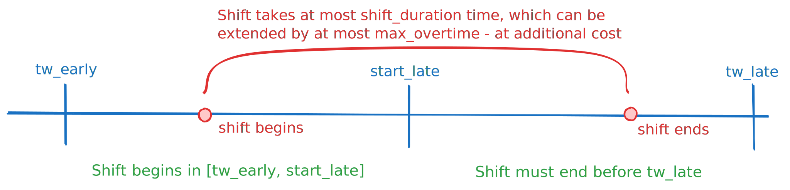

Concepts
========

This page explains how different attributes of PyVRP's data model relate.

Time and duration constraints
-----------------------------

Clients and vehicle types are equipped with time windows.
In the case of clients, the time window indicates when service at the client may *begin*.
A vehicle may arrive at a client before its time window opens, in which case it waits until the opening of the time window to begin service.
Arriving late, that is, after the client time window closes, is not allowed in a feasible solution.
Service takes a certain duration to complete, after which the vehicle is free to leave the client.

.. figure:: ../assets/images/duration-client.svg
   :alt: Duration attributes of ``Client`` objects.
   :figwidth: 100%

.. note::

   Client time windows prescribe when service may *begin*.
   Service is allowed to complete after the time window is already closed!

.. hint::

   You can model clients with multiple time windows using a mutually exclusive client group.

Vehicles also have their own, rich set of duration constraints.
These are described graphically in the following figure.
TODO

