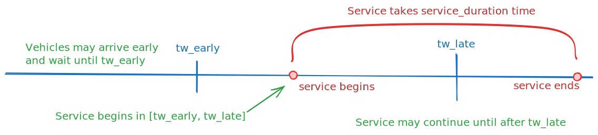

Concepts
========

This page explains how different attributes of PyVRP's data model relate.

Time and duration constraints
-----------------------------

Clients and vehicles are equipped with time windows, and a number of other time and duration-related attributes.
Together, these attributes can be used to model a rich set of constraints.
Below, we explain the attributes, and how these can be used to enforce different constraints.

Clients
^^^^^^^

In the case of clients modelled using the :class:`~pyvrp._pyvrp.Client` object, the time window indicates when service at the client may *begin*.
Service is allowed to complete after the time window is already closed.
A vehicle may arrive at a client before its time window opens, in which case it waits until the opening of the time window to begin service.
Arriving late, that is, after the client time window closes, is not allowed in a feasible solution.
Service takes a certain duration to complete, after which the vehicle is free to leave the client.
The following figure explains this graphically.

Vehicles
^^^^^^^^

Vehicles modelled using the :class:`~pyvrp._pyvrp.VehicleType` object support several duration constraints.
In particular, vehicles are equipped with time window attributes limiting the earliest start and latest completion times of a vehicle's assigned route.
Between these two times, a vehicle may execute a route of a given maximum duration.
Additionally, the starting time of the vehicle's assigned route may be further constrained to happen during the beginning of the time window. 
The following figure explains this graphically.

.. figure:: ../assets/images/duration-vehicletype.svg
   :alt: Duration attributes of ``VehicleType`` objects.
   :figwidth: 100%
