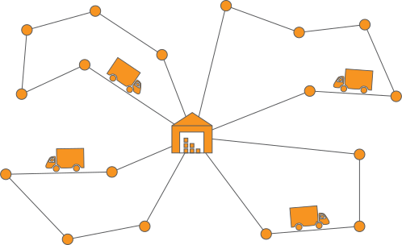

A brief introduction to VRP
===========================

The vehicle routing problem (VRP) is one of the most studied problems in the field of operations research motivated by applications such as postal delivery, waste collection, and many more.
The overarching goal of the VRP is to determine a set of vehicle routes to fulfil all (or some) transportation requests at the lowest possible cost.

Motivated by the enormous potential for cost savings, creating algorithms to compute cost-efficient solutions has been a primary focus for VRP researchers.
While finding a feasible solution for a given VRP is often relatively simple, obtaining the optimal solution can be considerably more complex as most VRP variants are classified as `NP-hard <https://en.wikipedia.org/wiki/NP-hardness>`_.
Various heuristics, metaheuristics, and exact methods have been developed to tackle the VRPs, including but not limited to, local search, genetic algorithms, and branch-and-cut algorithms.

.. note::

   PyVRP primarily implements heuristic and metaheuristic algorithms for solving vehicle routing problems (VRPs).
   As these algorithms do not guarantee optimal solutions, we rigorously :doc:`benchmark <benchmarks>` them to evaluate their effectiveness.
   For a state-of-the-art exact solver, see, for example, `VRPSolverEasy <https://github.com/inria-UFF/VRPSolverEasy>`_.

Supported VRP variants
----------------------

In this section, we introduce the VRP variants that PyVRP currently supports.
An extensive list of VRP variants can be found in `Toth and Vigo (2014) <https://doi.org/10.1137/1.9780898718515>`_.

In the following, we consider a complete graph :math:`G=(V,A)`, where :math:`V` is the vertex set and :math:`A` is the arc set.
The vertex set :math:`V` is partitioned into :math:`V= V_d \cup V_c`, where :math:`V_d = \{0, 1, \ldots, m - 1 \}` represent the set of :math:`m` depots, and :math:`V_c=\{m, \dots, n + m\}` denotes the set of :math:`n` clients.
Each arc :math:`(i, j) \in A` has a weight :math:`d_{ij} \ge 0` that represents the travelling cost (e.g., distance) when going from :math:`i \in V` to :math:`j \in V`.
A fleet of vehicles :math:`K_i` is assumed to be available at each depot :math:`i \in V_d`.

.. note::

   If the VRP variant you are interested in is not listed here, it might still be possible to add support for it to PyVRP.
   If you're interested in working on that, head over to the :doc:`contributing <../dev/contributing>` and :doc:`supporting new VRP variants <../dev/new_vrp_variants>` pages to get started!

Capacitated vehicle routing problem
^^^^^^^^^^^^^^^^^^^^^^^^^^^^^^^^^^^

The most studied variant of the vehicle routing problem is the *capacitated vehicle routing problem* (CVRP).
In this variant, each client :math:`i \in V_c` has a demand :math:`q_{i} \ge 0`, and there is a single depot, that is, :math:`V_d = \{ 0 \}`.
It is also assumed that the fleet of vehicles :math:`K_0` is homogeneous, meaning that they all have the same maximum capacity :math:`Q > 0`.

A feasible solution to the CVRP consists of a set of routes that all begin and end at the depot, such that each client is visited exactly once and none of the routes exceeds the vehicle capacity.
The objective is to find a feasible solution that minimises the total travelling cost.

Vehicle routing problem with time windows
^^^^^^^^^^^^^^^^^^^^^^^^^^^^^^^^^^^^^^^^^

The *vehicle routing problem with time windows* (VRPTW) is an extension of the capacitated VRP that introduces timing constraints.
Each arc :math:`(i, j) \in A` has an additional parameter :math:`t_{ij}`, denoting the travel time from location :math:`i` to :math:`j`.
Each client :math:`i \in V_c` has a demand :math:`q_{i} \ge 0`, a service time :math:`s_{i} \ge 0` and a time window :math:`\left[e_i, l_i\right]` that denotes the earliest and latest time that service can start at the client.
A vehicle is allowed to arrive at a location before the beginning of the time window, but it must wait for the window to open to start the service.
The single depot has a time window :math:`\left[0, H \right]`, where :math:`H` is the latest time at which all vehicles must have returned.

A feasible solution to the VRPTW consists of a set of routes in which all clients are visited within the specified time window and all vehicles return to the depot in time.
The objective is to find a feasible solution that minimises the total travel cost.

.. hint::

   Check out :ref:`this example notebook </examples/basic_vrps.ipynb>` in which we solve CVRP and VRPTW instances.

Prize-collecting vehicle routing problem
^^^^^^^^^^^^^^^^^^^^^^^^^^^^^^^^^^^^^^^^^

In the *prize-collecting vehicle routing problem* (PC-VRP), it is not mandatory to visit all clients.
Some client visits may be required, but most are considered optional, and client have a prize :math:`p_i \ge 0` that is collected when client :math:`i` is visited.
The goal is to balance the competing goals of minimising travel costs while maximising the collected prizes.

Multi-depot vehicle routing problem
^^^^^^^^^^^^^^^^^^^^^^^^^^^^^^^^^^^

In the *multi-depot vehicle routing problem* (MDVRP), multiple depots are available.
At each depot :math:`i \in V_d`, a fleet of vehicles :math:`K_i` is available that can service clients.
Each client can be serviced from any depot, but the goal is to assign clients to vehicles (and, by extension, depots) in such a way that travel costs are minimised.
